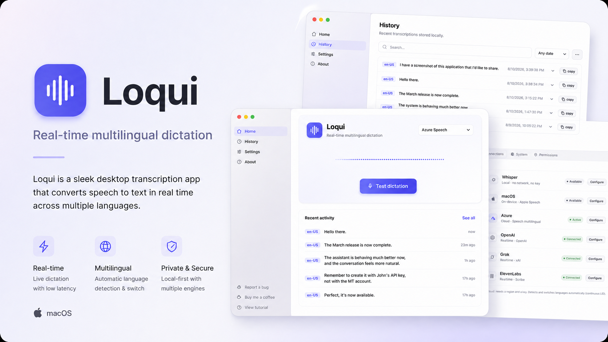

[English](README.md) · Español

# Loqui

Dictado multilingüe en tiempo real para macOS.

## ¿Qué es Loqui?

Loqui convierte tu voz en texto dentro de cualquier aplicación de macOS. Mantén presionada la tecla configurada, habla y Loqui inserta la transcripción donde esté el cursor. Puedes usar un motor local para mayor privacidad o conectar un motor opcional en la nube cuando necesites sus idiomas o capacidades en tiempo real.

## Descargar

[**Descargar la versión más reciente de Loqui**](https://github.com/Juan-Motta/loqui/releases/latest)

La versión actual es **v0.1.1**:

- Aplicación: [Loqui-0.1.1-macos-arm64.dmg](https://github.com/Juan-Motta/loqui/releases/download/v0.1.1/Loqui-0.1.1-macos-arm64.dmg)
- Suma de verificación: [Loqui-0.1.1-macos-arm64.dmg.sha256](https://github.com/Juan-Motta/loqui/releases/download/v0.1.1/Loqui-0.1.1-macos-arm64.dmg.sha256)

Loqui requiere una Mac con Apple Silicon. La aplicación declara macOS 14 como versión mínima de ejecución, mientras que la versión pública actual se ha probado en macOS 26. Apple Speech solo está disponible en macOS 26 o posterior.

## Funcionalidades

- Dicta directamente en la aplicación donde está el cursor.
- Admite motores multilingües y de transcripción en tiempo real.
- Guarda las transcripciones recientes en un historial local con búsqueda.
- Ofrece motores locales para un uso privado y compatible con trabajo sin conexión.
- Admite motores opcionales en la nube cuando necesitas sus modelos y capacidades.
- Permite cambiar de motor sin modificar tu forma de dictar.

## Motores compatibles

| Motor | Ejecución | Recomendado para | Notas |
| --- | --- | --- | --- |
| Whisper | Local | Transcripción privada y sin conexión | Requiere descargar una vez el modelo desde **Ajustes → Conexiones**. |
| Apple Speech | En el dispositivo | Transcripción nativa de macOS | Requiere macOS 26 o posterior. |
| Azure Speech | Nube | Dictado multilingüe continuo | Requiere una clave y una región de Azure Speech. |
| Azure OpenAI Realtime | Nube | Transcripción en streaming con tu deployment de Azure | Admite deployments basados en `gpt-realtime-whisper` o `gpt-live-transcribe`; requiere un recurso de Azure OpenAI y una clave. |
| xAI / Grok | Nube | Transcripción en tiempo real | Requiere una API key de xAI. |
| OpenAI Realtime | Nube | Transcripción en tiempo real | Requiere una API key de OpenAI. |
| ElevenLabs | Nube | Transcripción en tiempo real | Requiere una API key de ElevenLabs. |

## Instalar y comenzar a dictar

1. Descarga el DMG desde la [versión más reciente](https://github.com/Juan-Motta/loqui/releases/latest).
2. Abre el DMG y copia **Loqui** en **Aplicaciones**.
3. Inicia Loqui. Si macOS bloquea la primera apertura, ve a **Configuración del Sistema → Privacidad y seguridad** y elige **Abrir de todos modos**.
4. Elige un motor de voz en **Ajustes → Conexiones** y configúralo si necesita una API key o una región. Si eliges Whisper, selecciona **Descargar modelo** allí y espera a que termine esa descarga inicial.
5. Concede los permisos de macOS que solicite la aplicación.
6. Coloca el cursor en cualquier campo de texto, mantén presionada la tecla de dictado configurada, habla y suelta la tecla.

El modelo de Whisper, de aproximadamente **465 MB**, debe descargarse una vez desde **Ajustes → Conexiones**; la descarga se puede reanudar. Apple Speech puede descargar automáticamente el modelo de idioma seleccionado la primera vez que se usa. Ninguno de los dos modelos está incluido en el DMG.

## Permisos de macOS

- **Micrófono** permite que Loqui te escuche y transcriba.
- **Accesibilidad** permite que Loqui pegue la transcripción en la aplicación activa. Sin este permiso, la transcripción puede completarse mientras macOS bloquea silenciosamente el `Cmd+V` sintético.
- **Monitoreo de entrada** permite que el auxiliar `globe-listener` detecte la tecla `fn`/Globo.

Abre **Configuración del Sistema → Privacidad y seguridad** para revisar estos permisos. En las compilaciones de desarrollo con firma ad hoc debes concederlos de nuevo después de cada build porque macOS los vincula a la firma cambiante; consulta la sección Desarrollo.

## Privacidad y API keys

Whisper y Apple Speech procesan el audio localmente. Azure Speech, Azure OpenAI Realtime, xAI/Grok, OpenAI Realtime y ElevenLabs envían el audio al proveedor seleccionado, sujeto a sus términos y política de privacidad. Loqui usa únicamente el motor que elijas.

Las claves guardadas viven en `~/Library/Application Support/LoquiGo/secrets.json`, con modo de archivo `0600`, en texto plano. Esto limita la lectura del archivo a tu usuario de macOS, pero no cifra su contenido. Activa FileVault para proteger las claves en reposo si se pierde la Mac o su almacenamiento.

Para sesiones temporales de desarrollo, estas variables de entorno específicas por proveedor tienen prioridad y evitan guardar la credencial correspondiente en `secrets.json`:

- `LOQUI_AZURE_KEY`
- `LOQUI_GROK_KEY`
- `LOQUI_OPENAI_KEY`
- `LOQUI_AZURE_OPENAI_KEY`
- `LOQUI_ELEVENLABS_KEY`

Cada variable corresponde únicamente a su proveedor. `LOQUI_AZURE_KEY` corresponde a Azure Speech; `LOQUI_AZURE_OPENAI_KEY`, al recurso y deployment independientes de Azure OpenAI Realtime.

Para Azure OpenAI, selecciona el modelo base por separado del nombre del deployment. Azure permite
nombres de deployment personalizados que no tienen que coincidir con `gpt-realtime-whisper` ni
`gpt-live-transcribe`.

## Desarrollo

El flujo normal de desarrollo usa los wrappers del repositorio para configurar de manera consistente las dependencias nativas y las herramientas fijadas.

### Requisitos

- Una Mac con Apple Silicon.
- **Go 1.25 o posterior**.
- **Node.js y npm**. El desarrollo local no fija actualmente una versión de Node.js; la Action de releases usa Node.js 24.
- **CMake**.
- **Xcode 26**, o las Command Line Tools equivalentes, que proporcionen el **SDK de macOS 26**.
- Acceso a internet para los paquetes de npm y las dependencias nativas del primer uso.

El requisito para compilar desde el código fuente es más estricto que el mínimo de ejecución declarado de macOS 14 porque el auxiliar `macos-stt` apunta a `arm64-apple-macos26.0`.

### Ejecutar localmente

```bash
git clone https://github.com/Juan-Motta/loqui.git
cd loqui
cd frontend && npm install && cd ..
./scripts/task.sh dev
```

La tarea de desarrollo inicia Wails con recarga en caliente. Concede Micrófono, Accesibilidad y Monitoreo de entrada cuando macOS lo solicite.

### Crear la aplicación

```bash
./scripts/task.sh build
./scripts/task.sh package
```

`build` compila el frontend y la aplicación en Go. `package` también compila los auxiliares nativos y crea `bin/loqui.app` con firma ad hoc. El wrapper de tareas resuelve el CLI de Wails fijado antes de ejecutar cualquiera de las dos tareas y descarga dependencias nativas verificadas cuando sea necesario.

### Comandos útiles

```bash
./scripts/task.sh dev            # ejecutar con recarga en caliente
./scripts/task.sh build          # compilar el frontend y la aplicación en Go
./scripts/task.sh package        # compilar auxiliares y crear bin/loqui.app con firma ad hoc
./scripts/task.sh test           # ejecutar las pruebas de Go
./scripts/task.sh vet            # ejecutar verificaciones estáticas de Go
./scripts/task.sh typecheck      # verificar el TypeScript del frontend
./scripts/task.sh check          # ejecutar toda la verificación local
./scripts/task.sh release:macos  # crear un release notarizado para mantenedores
./scripts/task.sh probe:devices  # listar micrófonos
./scripts/task.sh probe:mic      # revisar localmente los niveles del micrófono
```

### Solución de problemas

No uses `go` directamente en este repositorio: el SDK de Azure Speech necesita rutas de cgo y opciones del linker que proporciona `scripts/go.sh`. De lo contrario, los comandos que alcancen el SDK pueden fallar con `fatal error: 'speechapi_c_error.h' file not found`. Usa los wrappers:

```bash
./scripts/go.sh test ./...
./scripts/go.sh run ./cmd/stt-probe -mic-only
./scripts/task.sh build     # resuelve automáticamente el CLI wails3 fijado
```

Con la firma ad hoc debes **volver a conceder los permisos** de Micrófono, Accesibilidad y Monitoreo de entrada después de cada build porque cambia la firma de la aplicación. Una identidad estable para firmar builds de desarrollo evita esta repetición.

Usa los diagnósticos específicos y las ayudas visuales para aislar problemas:

```bash
./scripts/go.sh run ./cmd/stt-probe -mic-only
XAI_API_KEY=... ./scripts/go.sh run ./cmd/stt-probe -provider grok
SPEECH_KEY=... ./scripts/go.sh run ./cmd/stt-probe
LOQUI_DEBUG_OVERLAY=1 ./bin/loqui.app/Contents/MacOS/loqui
LOQUI_DEBUG_DICTATE=6 ./bin/loqui.app/Contents/MacOS/loqui
```

### Estructura del proyecto

```text
main.go, wiring.go      aplicación Wails: ventanas, bandeja y hotkey
internal/session/       controlador de dictado y pruebas
internal/stt/           contrato de proveedores de voz y motores
internal/audio/         captura del micrófono y niveles de audio
internal/inject/        pegado seguro en la aplicación activa
internal/store/         configuración y almacenamiento de credenciales
internal/hotkey/        protocolo y listener de la tecla fn/Globo
helpers/                auxiliares nativos en Swift y C++
frontend/               Configuración, Historial y overlay de dictado
cmd/stt-probe/          diagnósticos desde la línea de comandos
```

Consulta [CONTINUITY.md](CONTINUITY.md) para conocer el estado actual del proyecto y [docs/plans/loqui-go-port.md](docs/plans/loqui-go-port.md) para ver el mapa del port y sus módulos.

## Releases para mantenedores

<details>
<summary>Automatización de releases en GitHub y configuración de Developer ID</summary>

**Release local con Developer ID**

Los releases para otras Mac requieren dos identidades y credenciales de notarización; los paquetes normales con firma ad hoc no las necesitan.

1. En Xcode, ve a **Settings → Accounts → Manage Certificates** y crea un certificado **Apple Development** para builds diarios estables.
2. Crea o descarga un certificado **Developer ID Application** desde la cuenta activa de Apple Developer. En Keychain Access, confirma que su clave privada aparezca debajo del certificado.
3. Exporta una vez el certificado Developer ID y su clave privada como un `.p12` cifrado, y guárdalo fuera de este repositorio en el respaldo cifrado del propietario.
4. Crea una contraseña específica de Apple y guárdala mediante el prompt interactivo de `notarytool`:

   ```bash
   printf 'Apple ID: '
   IFS= read -r APPLE_ID
   printf 'Apple Team ID: '
   IFS= read -r TEAM_ID
   xcrun notarytool store-credentials loqui-notary \
     --apple-id "$APPLE_ID" --team-id "$TEAM_ID"
   unset APPLE_ID TEAM_ID
   ```

La contraseña se omite intencionalmente: `notarytool` la solicita de forma segura y valida las credenciales antes de guardarlas. Verifica la configuración sin copiar hashes de identidades ni credenciales en reportes:

```bash
security find-identity -v -p codesigning
xcrun notarytool history --keychain-profile loqui-notary --output-format json >/dev/null
```

Ejecuta toda la verificación local inmediatamente antes del punto de entrada del release:

```bash
./scripts/task.sh check
LOQUI_NOTARY_PROFILE=loqui-notary ./scripts/task.sh release:macos
```

Un resultado exitoso publica `bin/release/Loqui-<version>-macos-arm64.dmg` únicamente después de completar la firma con Developer ID, la notarización, el stapling, la evaluación de Gatekeeper y la publicación atómica.

**Automatización de releases en GitHub**

La Action **Release** solo se ejecuta manualmente y publica la versión que ya se integró en `main`. Usa el Environment `release` protegido; nunca edita `build/config.yml`, mueve un tag existente ni elimina un estado remoto ambiguo.

Configuración inicial:

1. Exporta desde Keychain Access la identidad **Developer ID Application** y su clave privada como un `.p12` cifrado. Valídalo localmente con `/usr/bin/openssl pkcs12 -noout`; el parser de Apple acepta los algoritmos heredados que Keychain Access puede generar.
2. Copia su representación base64 sin escribir el material codificado en este repositorio:

   ```bash
   base64 -i /absolute/path/DeveloperID.p12 | pbcopy
   ```

   En un directorio temporal privado, verifica también que la decodificación produzca un `.p12` no vacío. Nunca pegues el archivo, su representación base64 ni su contraseña en logs, issues, commits o pull requests.
3. En App Store Connect, crea una **Team API key** con acceso de notarización y descarga su `.p8` disponible una sola vez. Conserva el Key ID y el Issuer ID. Las Individual API keys no son compatibles porque el workflow usa el contrato `--issuer` de las Team keys.
4. Crea el Environment `release`, restringe las ramas de despliegue exactamente a `main`, agrega un revisor obligatorio y deja **Prevent self-review** desactivado mientras este sea un repositorio de un solo mantenedor. Esto proporciona confirmación del operador, no separación de funciones.
5. Agrega estos cinco secretos al Environment, no como secretos del repositorio:

   - `MACOS_CERTIFICATE_P12_BASE64`
   - `MACOS_CERTIFICATE_PASSWORD`
   - `APP_STORE_CONNECT_API_KEY_P8`
   - `APP_STORE_CONNECT_KEY_ID`
   - `APP_STORE_CONNECT_ISSUER_ID`

Permite que el job protegido del release solicite `contents: write`; el job de preflight permanece en modo de solo lectura y no puede acceder a los secretos del Environment. Los Draft Releases se comprueban durante la revalidación del job protegido porque GitHub no los expone al token de solo lectura.

Para cada release, cambia mediante un PR normal la versión estable entre comillas en `build/config.yml` y luego ejecuta:

```bash
./scripts/patch-plists.sh
./scripts/task.sh check
```

Después de integrar ese PR, abre **Actions → Release → Run workflow**, selecciona `main`, revisa el preflight sin secretos y aprueba el despliegue pendiente del Environment. El grupo de concurrencia de todo el repositorio serializa los releases: no dejes una aprobación pendiente indefinidamente ni inicies varias ejecuciones de reemplazo, porque GitHub puede cancelar una ejecución pendiente más antigua.

Si finaliza correctamente, verifica que el tag apunte al commit registrado y que el Release público contenga exactamente el DMG, su `.sha256` y las notas generadas. La evidencia de éxito y cualquier evidencia saneada disponible de fallos de notarización se conservan como artifacts de Actions durante 14 días, nunca como assets públicos del Release.

Si la publicación informa un estado residual ambiguo, inspecciónalo antes de modificar nada:

```bash
gh release view vX.Y.Z
git ls-remote --tags origin refs/tags/vX.Y.Z
```

La Action nunca elimina contenido. Solo cuando la inspección demuestre que hay un draft/tag parcial y no anunciado, un mantenedor puede ejecutar deliberadamente `gh release delete vX.Y.Z --cleanup-tag --yes` y volver a iniciar el workflow. Nunca elimines un release público; reemplaza un build público defectuoso con una nueva versión patch.

</details>
